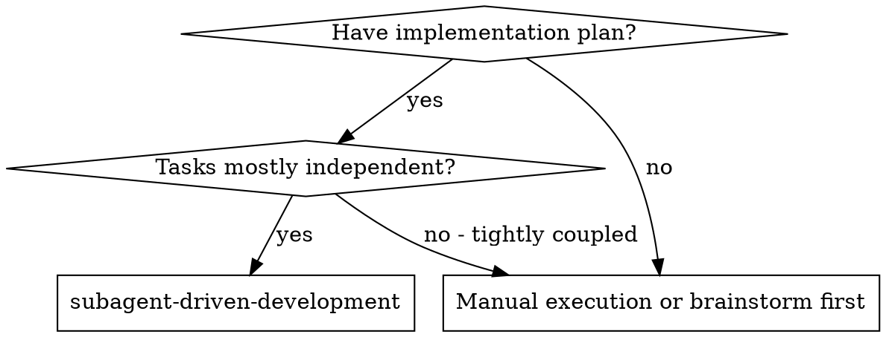
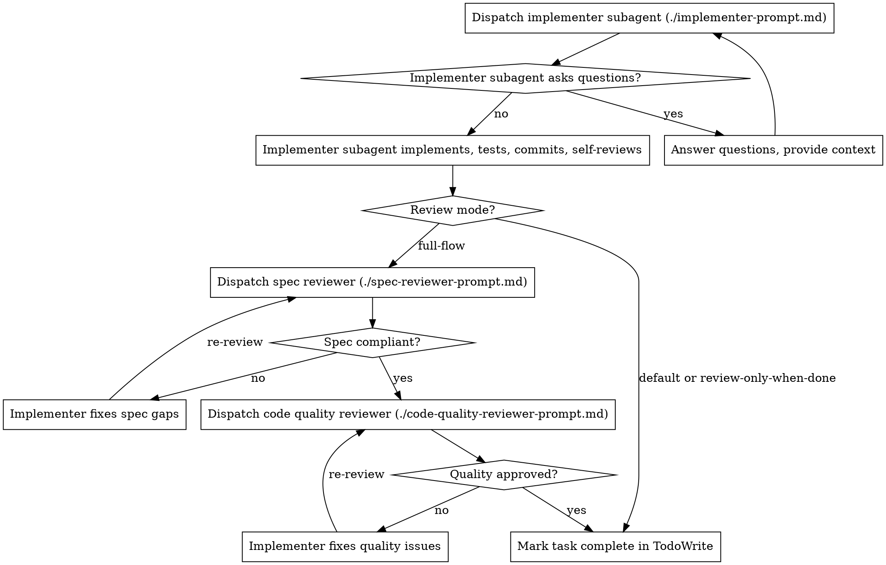

# Subagent-Driven Development

Execute plan by dispatching a fresh implementer subagent per task. Review depth is configurable via **review mode**.

**Why subagents:** You delegate tasks to specialized agents with isolated context. By precisely crafting their instructions and context, you ensure they stay focused and succeed at their task. They should never inherit your session's context or history — you construct exactly what they need. This also preserves your own context for coordination work.

**Core principle:** Fresh subagent per outlined task = fast, focused iteration. The controller should not implement plan tasks directly; every task listed in the plan is delegated unless the user explicitly asks for direct implementation.

**Continuous execution:** Do not pause to check in with your human partner between tasks. Execute all tasks from the plan without stopping. The only reasons to stop are: BLOCKED status you cannot resolve, ambiguity that genuinely prevents progress, or all tasks complete. "Should I continue?" prompts and progress summaries waste their time — they asked you to execute the plan, so execute it.

## Review Modes

Pick a mode at the start of the run. **Default is `default`** unless the user names another mode.

| Mode | Per-task implementers | Per-task spec + quality reviews | Final feature review |
|------|----------------------|---------------------------------|---------------------|
| **`default`** | Yes | No | No |
| **`review-only-when-done`** | Yes | No | Yes |
| **`full-flow`** | Yes | Yes (spec, then quality) | Yes |

**How users select a mode:**
- Unspecified → `default`
- "review when done", "final review only", "review at the end" → `review-only-when-done`
- "full flow", "full reviews", "two-stage review", "spec and quality review" → `full-flow`
- "no reviews" → `default` (same as default; implementer self-review only)

**Mode overrides:** If the user contradicts the chosen mode mid-run (e.g. "no reviews" during `full-flow`), follow the latest explicit instruction for the remainder of the run.

## When to Use



## The Process

At start: read plan, extract all tasks with full text, note context, pick review mode, create TodoWrite. Before dispatching an implementer, inspect the target repo/worktree for project-local skills under `.agents/skills/*/SKILL.md`. If a task involves setup, validation, tests, dependencies, or environment, include the relevant project-local skill path in the implementer prompt as a **FIRST ACTION REQUIRED**.

### Per task (all modes)



### After all tasks

| Mode | Next step |
|------|-----------|
| `default` | **/finalize-feature** |
| `review-only-when-done` | Dispatch final feature reviewer → then /finalize-feature |
| `full-flow` | Dispatch final feature reviewer → then /finalize-feature |

Final feature reviewer uses the **controller's currently selected model** (see Subagent Model Selection). Per-task subagents use the **per-task tier** (see Subagent Model Selection).

## Subagent Model Selection

Two tiers.

| Tier | Used for | Model |
|------|----------|-------|
| **Per-task** | Implementers, spec reviewers, code quality reviewers, fix passes | See below |
| **Controller** | Final feature reviewer only (`review-only-when-done`, `full-flow`) | Controller's currently selected model, unchanged |

### Per-task tier

1. **Prefer auto balanced routing** — omit the Task `model` parameter so the platform router picks.
2. **If you must pin a model** (user asked, or auto is unavailable/unsuitable): choose a **medium** model suited to the job. Prefer the smallest model that can do the work; do not overshoot to high/max/opus variants when medium will do.
3. **Honor explicit user model requests** when given.

**Do not** silently upgrade per-task subagents to the strongest available model "to be safe."

### Controller tier (final feature review)

Dispatch with the **controller's currently selected model** — full capability for that model, no downgrade to a weaker per-task default. This is the one subagent that should apply broad judgment across the full implementation.

### Escalation

If a task looks too hard for a medium/auto per-task dispatch, break it down or ask before escalating to a stronger pinned model.

**Task complexity signals:**
- Touches 1-2 files with a complete spec → auto / medium is enough
- Touches multiple files with integration concerns → consider splitting before escalating
- Requires design judgment or broad codebase understanding → ask before escalating per-task model

## Handling Implementer Status

Implementer subagents report one of four statuses. Handle each appropriately:

**DONE:**
- `default` or `review-only-when-done` → mark task complete, next task
- `full-flow` → proceed to spec compliance review

**DONE_WITH_CONCERNS:** Read concerns before proceeding. If about correctness or scope, address before moving on (and before per-task reviews in `full-flow`). Observations only → note and continue per mode.

**NEEDS_CONTEXT:** Provide missing context and re-dispatch.

**BLOCKED:** Assess the blocker:
1. Context problem → provide context, re-dispatch same model
2. Needs more reasoning → break down or ask before stronger model
3. Task too large → split into smaller pieces
4. Plan is wrong → escalate to the human

**Never** ignore an escalation or force the same model to retry without changes.

## Prompt Templates

- `./implementer-prompt.md` - Dispatch implementer subagent
- `./spec-reviewer-prompt.md` - Dispatch spec compliance reviewer (`full-flow` only)
- `./code-quality-reviewer-prompt.md` - Dispatch code quality reviewer (`full-flow` only)

Final feature reviewer (`review-only-when-done` and `full-flow`): use **/code-review** with the controller tier model.

## Example Workflow (`default` mode)

```
You: I'm using Subagent-Driven Development (default mode) to execute this plan.

[Read plan, extract tasks, create TodoWrite]

Task 1: Hook installation script

[Dispatch implementer subagent — per-task tier, auto/medium]

Implementer: DONE — implemented, 5/5 tests, self-review clean, committed

[Mark Task 1 complete — no review subagents]

Task 2: Recovery modes

[Dispatch implementer subagent]

Implementer: DONE — 8/8 tests, committed

[Mark Task 2 complete]

...

[All tasks done → /finalize-feature]
```

### `review-only-when-done` add-on

After all tasks complete, dispatch one final feature reviewer using the controller tier. Fix any issues it finds, re-review until approved, then /finalize-feature.

### `full-flow` add-on (per task, after implementer DONE)

```
[Dispatch spec reviewer — per-task tier, auto/medium]
Spec reviewer: ✅ or ❌ → implementer fixes → re-review until ✅

[Dispatch code quality reviewer — per-task tier, auto/medium]
Code reviewer: ✅ or ❌ → implementer fixes → re-review until ✅

[Mark task complete]
```

After all tasks: final feature reviewer on controller tier, then /finalize-feature.

## Advantages

**vs. Manual execution:**
- Subagents follow TDD naturally
- Fresh context per task
- Parallel-safe (subagents don't interfere)
- Subagent can ask questions before and during work

**Quality gates by mode:**
- All modes: implementer self-review
- `review-only-when-done`: one holistic final review (controller tier)
- `full-flow`: per-task spec + quality gates plus final review

**Cost by mode:**
- `default`: one subagent per task (lowest)
- `review-only-when-done`: one sub task + one final review
- `full-flow`: implementer + two reviewers per task + final review (highest; catches issues earliest)

## Red Flags

**Never:**
- Start implementation on main/master without explicit user consent
- Dispatch multiple implementation subagents in parallel (conflicts)
- Make subagent read plan file (provide full text instead)
- Skip scene-setting context
- Ignore implementer questions
- Silently overshoot per-task model choice (pin high/max/opus when auto/medium would do)
- Silently downgrade the final reviewer below the controller model

**In `full-flow` only — never:**
- Skip spec or code quality review for a completed task
- Proceed with unfixed review issues
- Accept "close enough" on spec compliance
- Skip review loops
- Let implementer self-review replace per-task reviews
- Start code quality review before spec compliance is ✅
- Move to next task while either per-task review has open issues

**If subagent asks questions:** Answer completely before they proceed.

**If reviewer finds issues (`full-flow` or final review):** Implementer or fix subagent addresses them; reviewer re-reviews until approved.

**If subagent fails task:** Dispatch fix subagent with specific instructions; don't fix manually (context pollution).

## Integration

**Required workflow skills:**
- **/sep-worktree** - Isolated workspace
- **/code-review** - Final reviewer and per-task quality templates
- **/finalize-feature** - After all tasks (and final review when applicable)

**Subagents should use:**
- **/test-driven-development** - TDD for each task
